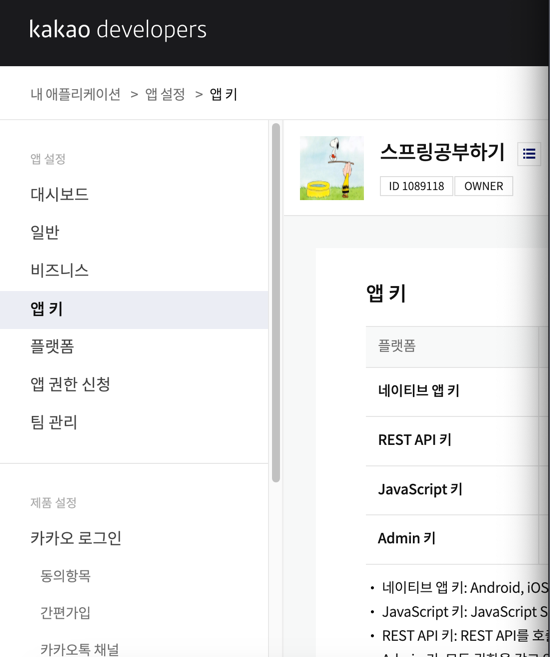
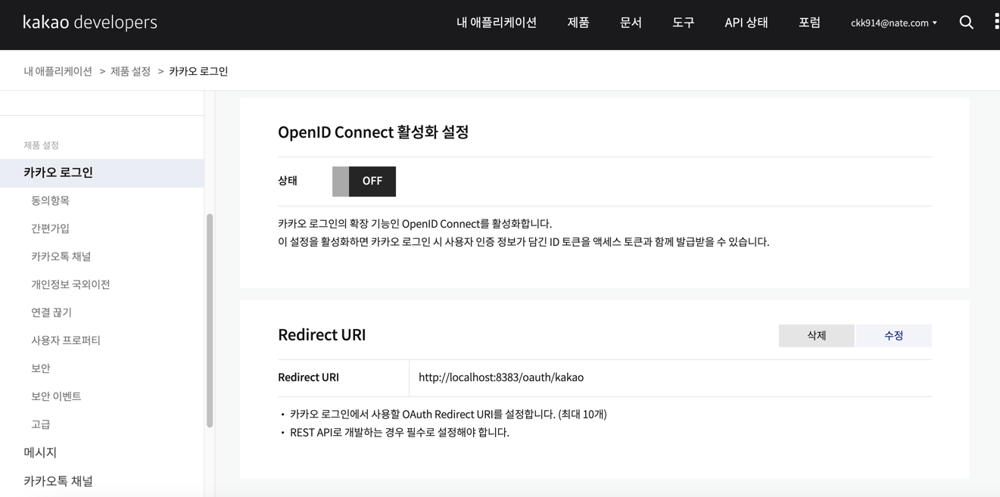

https://developers.kakao.com/

좌측 -앱키 REST API 키


Redirect URI 주소 
등록 누르고
http://localhost:8383/oauth/kakao
로컬호스트 8383 뒷부분은 직접 적으면 됨
1. jsp 에서 a링크로 클릭하게 만들기!
2. 서버 코드
```dtd
  //a링크 클릭 시에는 무조건 get으로 들어온다⭐️
    @GetMapping("/kakao/login")
    public String kakaoLogin() {
        //카카오 서버로 인가 코드 발급 통신을 해야함
        String uri = "https://kauth.kakao.com/oauth/authorize";
        uri += "?client_id="+appKey;
        uri += "&redirect_uri="+redirectUri;
        uri += "&response_type=code";


        return "redirect:" + uri;
    }
```
로그인 get 방식으로 매핑받고 
redirect 날리고 

인가 코드 받기
```dtd
//인가 코드를 받는 요청(kakaoLogin→인가코드 받기)
    @GetMapping("/oauth/kakao")
        public String kakaoCode(String code, HttpSession session){
        log.info("카카오 인가 코드 발급 -{}",code);
        //토큰 발급에 필요한 파라미터 만들기
HashMap<String, Object> requestParams = new HashMap<>();
requestParams.put("appKey",appKey);
requestParams.put("redirect",redirectUri);
requestParams.put("code",code);

        //인증 액세스 토큰 발급 요청
        snsLoginService.kakaoLogin(requestParams,session);

        return "redirect:/";
        }

```
겟방식은 다 리다이렉트 치면 됨~!

---
- 토큰 받기

서비스 코드
```dtd
//카카오 로그인 처리 서비스 로직
    public void kakaoLogin(Map<String, Object> requestParams, HttpSession session) {
        //토큰 발급 요청
        String accessToken = getKakaoAccessToken(requestParams);
        // 발급받은 토큰으로 사용자 정보 가져오기
        KakaoUserDto.Properties userInfo = getKakaoUserInfo(accessToken);
        //카카오에서 받은 회원 정보로 우리 사이트 회원가입 시키기!
        String account = userInfo.getNickname();
        //회원 중복 확인
        if(memberService.checkIdentifier("account",account)){
            throw new IllegalArgumentException("이미 가입한 회원입니다.");
        }

        memberService.join(
                SignUpDto.builder()
                        .account(account)
                        .password("0000")
                        .name(account)
                        .email(account+"@kakao.com")
                        .build(),
                userInfo.getProfileImage()
        );

        //우리 사이트 로그인 처리
        MemberService.maintainLoginState(session, memberMapper.findOne(account));
        //세션에 현재 로그인 방식에 대해 지정
        session.setAttribute("loginPath","kakao");
    }
    // 토큰으로 사용자 정보 요청
    private KakaoUserDto.Properties getKakaoUserInfo(String accessToken) {
        log.debug("accessToken:{}",accessToken);
        // request uri
        String requestUri = "https://kapi.kakao.com/v2/user/me";

        // 헤더 설정
        HttpHeaders headers = new HttpHeaders();
        headers.add("Authorization", "Bearer " + accessToken);
        headers.add("Content-type", "application/x-www-form-urlencoded;charset=utf-8");


        // 요청 보내기
        RestTemplate template = new RestTemplate();
        ResponseEntity<KakaoUserDto> response = template.exchange(
                requestUri
                , HttpMethod.POST
                , new HttpEntity<>(headers)
                , KakaoUserDto.class
        );

        // 응답 정보 JSON 꺼내기
        // dto 로 꺼내는 게 좋음!⭐️
        KakaoUserDto json = response.getBody();
        log.debug("user profile: {}", json);

        //필요한 것만 리턴 닉네임 프로필 사진
        return json.getProperties();

    }
    //토큰 발급 요청~!
    private String getKakaoAccessToken(Map<String, Object> requestParams) {
        //요청 uri
        String requestUri = "https://kauth.kakao.com/oauth/token";
        //요청 헤더 설정
        HttpHeaders headers = new HttpHeaders();
        headers.add("Content-Type", "application/x-www-form-urlencoded;charset=utf-8");

        // POST 요청은 쿼리 파라미터를  URI에 붙일 수 없음!
        //요청 바디에 쿼리 파라미터를 넣어야 함
        LinkedMultiValueMap<String, Object> params = new LinkedMultiValueMap<>();
        params.add("grant_type", "authorization_code");
        params.add("client_id", requestParams.get("appKey"));
        params.add("redirect_uri", requestParams.get("redirect"));
        params.add("code", requestParams.get("code"));

        //요청 헤더와 요청 바디를 담을 객체 생성
        HttpEntity<Object> entity = new HttpEntity<>(params, headers);

        //카카오 인증 서버로 post 요청 보내기
        RestTemplate template = new RestTemplate();

        //서버에서 서버로 통신할때 (=fetch와 같음.)
        /*
        - RestTemplate객체가 REST API 통신을 위한 API인데 (자바스크립트 fetch역할)
            - 서버에 통신을 보내면서 응답을 받을 수 있는 메서드가 exchange

            param1: 요청 URL
            param2: 요청 방식 (get, post, put, patch, delete…)
            param3: 요청 헤더와 요청 바디 정보 - HttpEntity로 포장해서 줘야 함
            param4: 응답결과(JSON)를 어떤 타입으로 받아낼 것인지 (ex: DTO로 받을건지 Map으로 받을건지)
        * */
        ResponseEntity<AccessTokenDto> response
//                = template.exchange(requestUri, HttpMethod.POST, entity, Map.class);
                = template.exchange(requestUri, HttpMethod.POST, entity,AccessTokenDto.class);

        //        log.debug("response: {}",response);

//        Map<String, Object> json = response.getBody();
        AccessTokenDto json = response.getBody();

        log.debug("json:{}", json);

//        String accessToken = (String)json.get("access_token");
//        json.get("access_token");
        String accessToken = json.getAccessToken();
        String refreshToken = json.getRefreshToken();
//        log.debug("token:{}",accessToken);
        log.debug("token: {}", accessToken);
        log.debug("refreshToken: {}", refreshToken);

        return accessToken;
    }

```

post 요청은 쿼리 파라미터를 uri 에 붙일 수 없음!
요청 바디에 쿼리 파라미터 넣어야함


