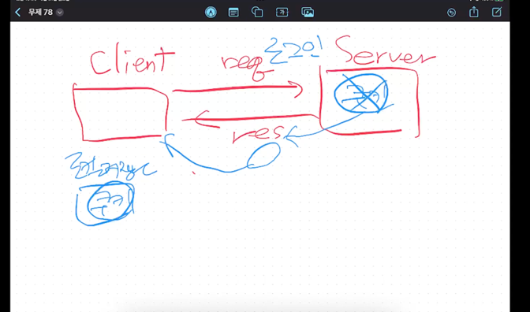

---
#쿠키

---

client   req-->  server
            <--res

로컬 저장소에 저장함 : 쿠키(클라이언트)

---

- server -> res -> client -> 로컬 저장소 (쿠키 보관(클라이언트가 보관))

---

: 예) 자동로그인 기능 (보안에 취약)
: 팔찌 같은 개념 (중간에 탈취 가능)

---
# 세션

---
client   req-->  server   
            <--res    (세션)

---
- 서버가 세션의 정보를 가지고 있음
- 서버가 여러대라면 , 문제가 있을 수 있음
- 쿠키 장점+ 세션 장점 = 토큰
- 보안엔 좋음
- 세션 설정 시간이 다되면 사라짐
- 또는 브라우저가 닫히면 세션 사라짐

쿠키와 세션은 웹사이트가 사용자를 식별하고 추적하는 전통적인 방법입니다.

1. **쿠키**: 쿠키는 사용자의 브라우저에 저장되는 작은 데이터 조각입니다. 쿠키는 주로 세션 관리, 사용자 선호도 추적, 개인화된 콘텐츠 제공 등을 위해 사용됩니다.
2. **세션**: 세션은 사용자 별로 서버에 저장되는 정보입니다. 쿠키와 비교하여, 세션은 보안상 더 우수하며, 더 큰 데이터를 저장할 수 있습니다. 그러나 이는 서버 메모리를 많이 사용하므로, 서버 부하가 크다는 단점이 있습니다.

쿠키는 갯수 제한이 있다 320개
쿠키로 조회수 관리를 하면 안된다
ㄴ 연습하는건데, 이렇게 하면 안된다
ㄴ 웹 좀 아는 사람은 쿠키를 지워서 악용한다.

### 정리

쿠키
쿠키는 네가 웹사이트를 사용할 때, 그 웹사이트가 너의 컴퓨터에 저장하는 작은 메모리야.
예를 들어, 네가 "자동 로그인" 기능을 사용할 때, 웹사이트가 너의 정보를 쿠키에 저장해서 다음에 들어올 때 자동으로 로그인되게 해줘.
하지만 쿠키는 누군가가 너의 컴퓨터에 접근하면 쉽게 볼 수 있어서, 보안에 취약할 수 있어.
세션
세션은 웹사이트가 서버에 저장하는 정보야. 네가 웹사이트에 들어가면, 서버가 너를 기억하고 필요한 정보를 저장해.
예를 들어, 네가 쇼핑몰에서 장바구니에 물건을 담으면, 그 정보가 세션에 저장되어 있어. 이렇게 하면 네가 다른 페이지로 가더라도 장바구니 내용이 사라지지 않아.
세션은 보안이 좋아서 누군가가 쉽게 접근할 수 없어. 그리고 세션은 시간이 지나거나 브라우저를 닫으면 사라져.
쿠키와 세션의 차이
저장 위치: 쿠키는 네 컴퓨터에 저장되고, 세션은 서버에 저장돼.
보안: 세션이 더 안전해!
데이터 용량: 세션은 더 많은 정보를 저장할 수 있어.
결론적으로, 웹사이트에서 너를 기억하게 하려면 쿠키나 세션을 사용해. 쿠키는 너의 컴퓨터에, 세션은 서버에 저장되는 정보라고 생각하면 돼!