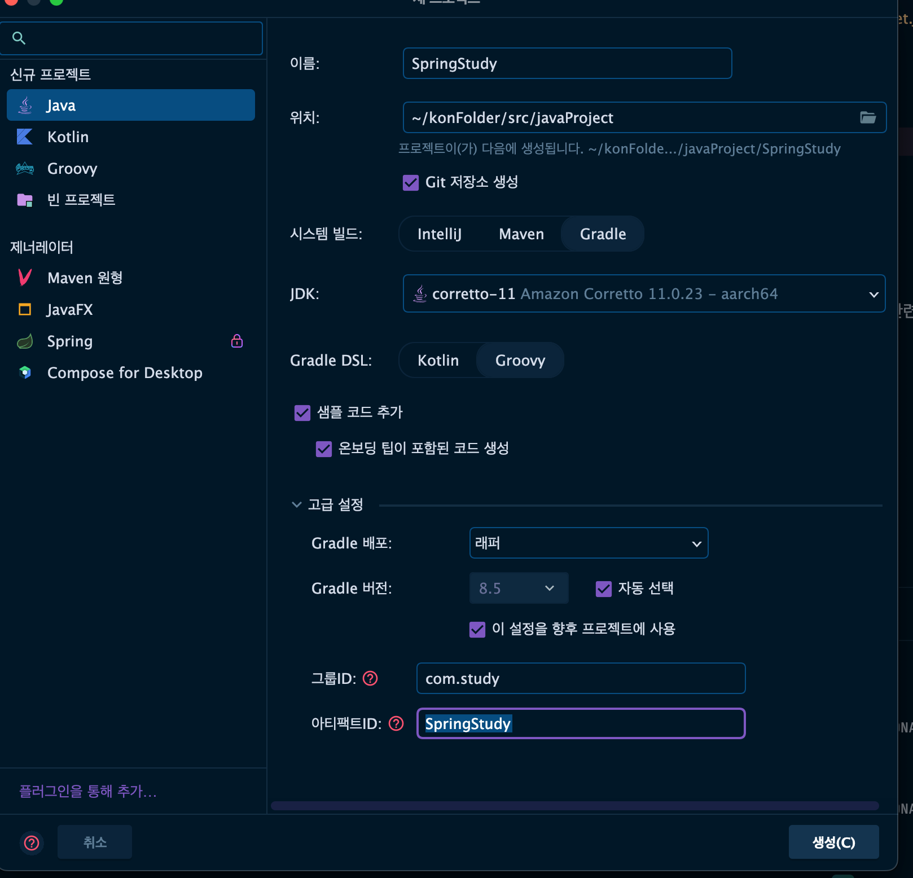
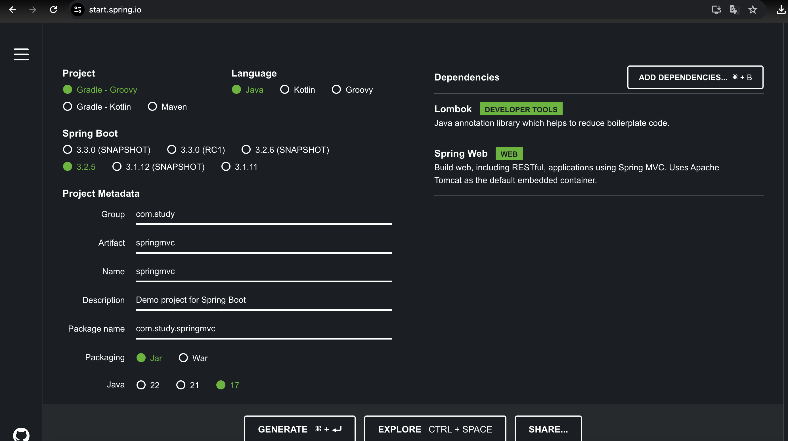
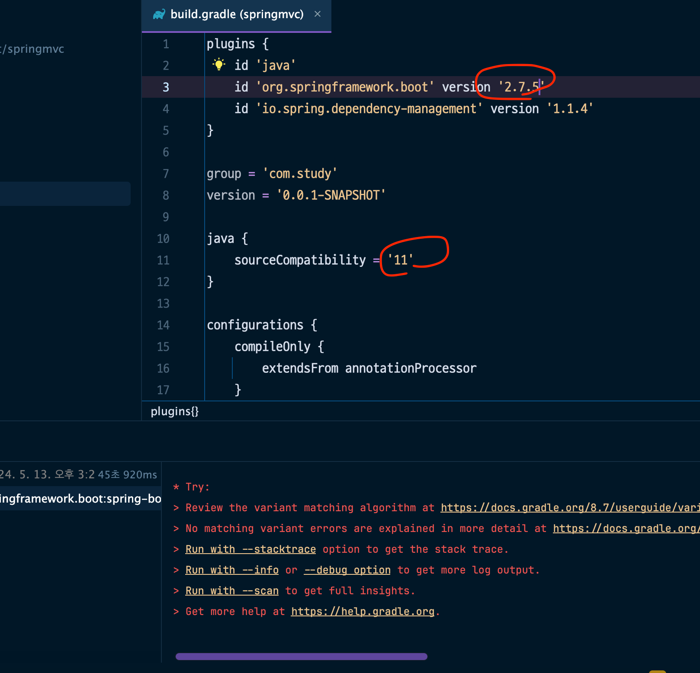

---
## 인텔리제이 내부에서 
## 스프링 프로젝트 생성 

---

Gradle - Groovy
프로젝트 생성 시.

고급 설정
그룹 id : 충돌 안나게 하기 위한 것
Com.oooooo : con.samsung 같은

아티팩트ID = 프로젝트 명 같게 
---
### 웹에서 만들기

사이트 주소: start.spring.io

Group : id 이름 적기
### Dependencies 선택 (사용할 라이브러리)
- Lombok
- Spring Web

Spring Boot / java 버전은 최신을 권장하게끔 나와 있는데,
일단 그냥 골라서 생성~!

build.gradle <= 설정 파일 
열어서 버전을 수정한다~

- framework.boot version 2.7.5
- java 11

