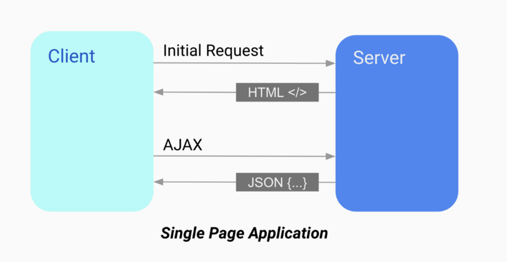
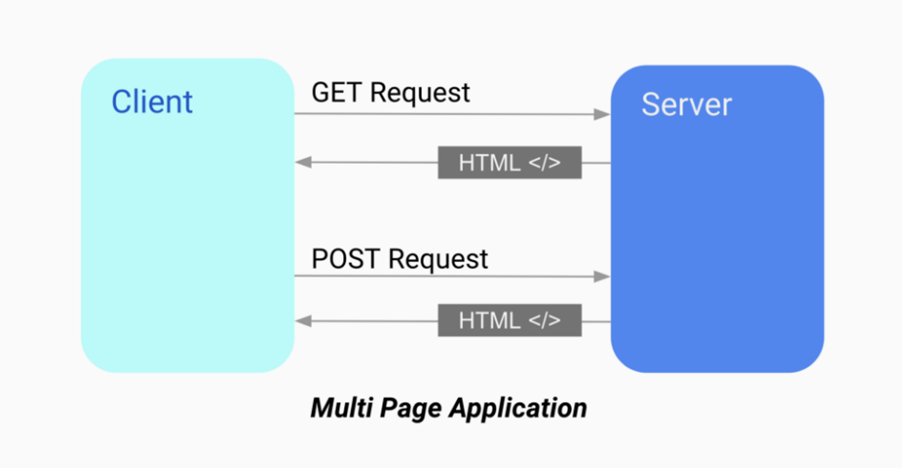

### 클라이언트 사이드 랜더링
- ㄴ 통신해서 실시간으로 데이터 받을 수 있다  
- 코드가 겁나 길어짐
- 사람이 필요한..
- json ajax 통신

서버 사이드 렌더링 (SSR)

ㄴ이건 웹페이지 

- 2개를 주로 섞어씀

---
- MPA(Multiple Page Application): 여러 개의 페이지로 구성된 애플리케이션****
-   ㄴ 예 ) jsp 나 페이지 등등 기본 웹

- SPA(Single Page Application): 단일 페이지로 구성된 애플리케이션으로, 
- 페이지 전환이 발생하지 않으며, 사용자가 페이지에서 요구하는 데이터를 
- 비동기적으로 서버에서 받아와 페이지 내에서 동적으로 렌더링합니다.
- 
- 주로 CSR과 함께 사용합니다.⭐️
- 
    - 초기 로딩 시간이 오래 걸리지만, 그 이후에는 필요한 데이터만 
    - 서버에서 받아와 화면을 업데이트하므로, 사용자 경험이 좋음
    - 
    - 클라이언트 측에서 처리되는 로직을 이용할 수 있어 빠른 응답성을 제공함
    - SEO 최적화에 취약하고, 
    - 클라이언트 측에서 처리되는 로직을 구현하기 위해서는
    - 별도의 프레임워크나 라이브러리를 사용해야 할 수 있음

